# AI Agent Skills 术语详解：2025-2026 完整指南（进阶版）

> 本文系统整理了 AI Agent 生态中的核心术语、架构组件和新兴标准，配合图解帮助你深入理解这个快速发展的领域。

---

## 一、核心概念全景图

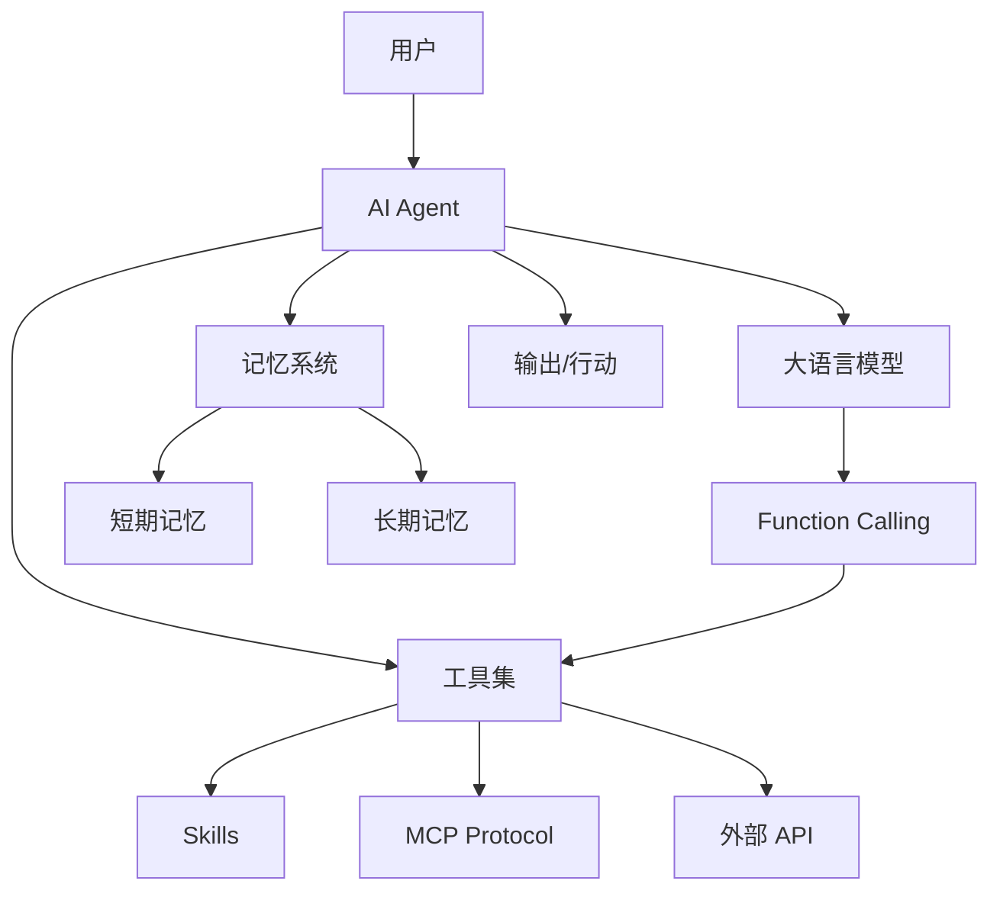

---

## 二、基础术语

### 1. AI Agent（智能体）

**定义**：能够感知环境、做出决策并执行动作的 AI 系统。

**核心能力**：
- 🧠 **推理** - 理解任务、规划步骤
- 🔧 **工具使用** - 调用外部 API、执行代码
- 💬 **对话** - 与用户自然交互
- 🔄 **记忆** - 保留上下文和历史

**Agent 工作循环**：

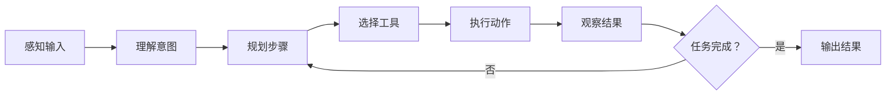

**示例**：
```
用户：帮我查下北京天气，然后写封邮件给团队

Agent 执行流程：
1. 解析意图 → 查天气 + 写邮件
2. 调用天气 API → 获取北京当前温度
3. 撰写邮件草稿 → 包含天气信息
4. 请求用户确认 → 等待批准
5. 调用邮件 API → 发送邮件
6. 返回确认 → 任务完成
```

---

### 2. Skill / Tool / Capability（技能/工具/能力）

这三个词经常混用，但有细微差别：

| 术语 | 含义 | 粒度 | 示例 |
|------|------|------|------|
| **Capability** | 抽象能力描述 | 最粗 | "能联网"、"能执行代码" |
| **Skill** | 高级能力，可能包含多个工具 | 中等 | "搜索技能"、"写作技能" |
| **Tool** | 具体可执行的函数/API | 最细 | `web_search()`, `send_email()` |

**层级关系**：

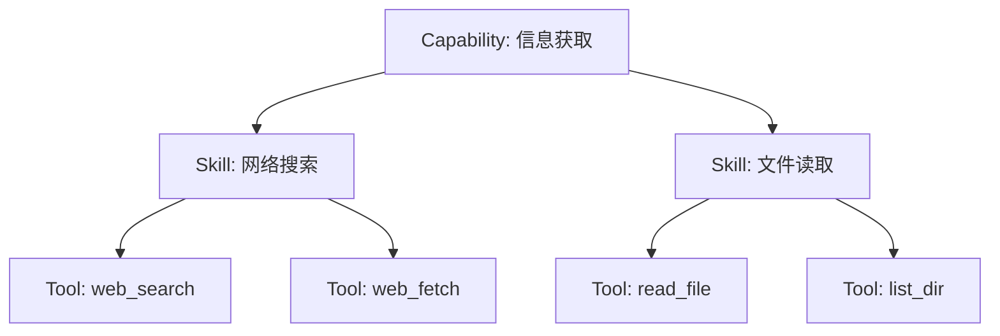

**技能结构示例**：
```yaml
skill: github
description: 管理 GitHub 仓库
capability: 代码协作
tools:
  - name: gh_issue_create
    description: 创建 Issue
  - name: gh_pr_review
    description: 审查 PR
  - name: gh_run_list
    description: 查看 CI 运行
config:
  - GITHUB_TOKEN
```

---

### 3. Function Calling（函数调用）

**定义**：LLM 识别用户意图后，调用外部函数获取结果。

**工作流程**：

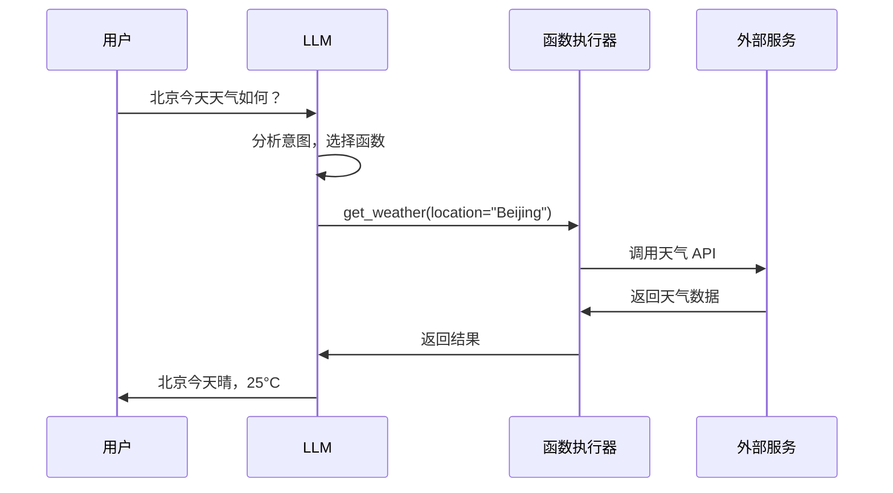

**示例**：
```json
// LLM 输出的函数调用
{
  "name": "get_weather",
  "arguments": {
    "location": "Beijing",
    "unit": "celsius"
  }
}

// 函数返回结果
{
  "temperature": 25,
  "condition": "sunny",
  "humidity": 45
}
```

---

## 三、架构组件

### 4. Orchestrator（编排器）

**定义**：协调多个 Agent 或工具完成复杂任务的中央控制器。

**职责**：
- 📋 任务分解
- 🎯 分配子任务给不同 Agent
- 🔗 整合结果
- ⚠️ 错误处理

**编排模式对比**：

| 模式 | 适用场景 | 优点 | 缺点 |
|------|----------|------|------|
| **集中式** | 简单任务 | 控制清晰 | 单点故障 |
| **分布式** | 复杂任务 | 灵活扩展 | 协调困难 |
| **混合式** | 中等复杂度 | 平衡灵活与控制 | 设计复杂 |

**示例架构**：

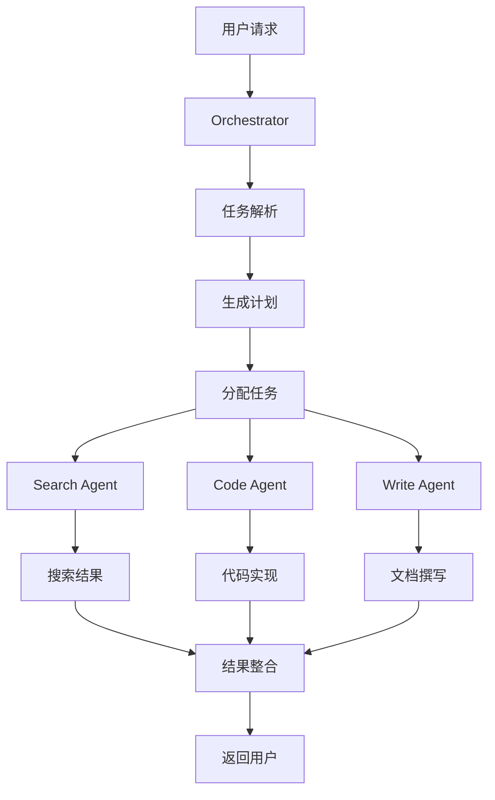

---

### 5. Memory System（记忆系统）

**定义**：让 Agent 记住历史对话和上下文信息的机制。

**三层记忆架构**：

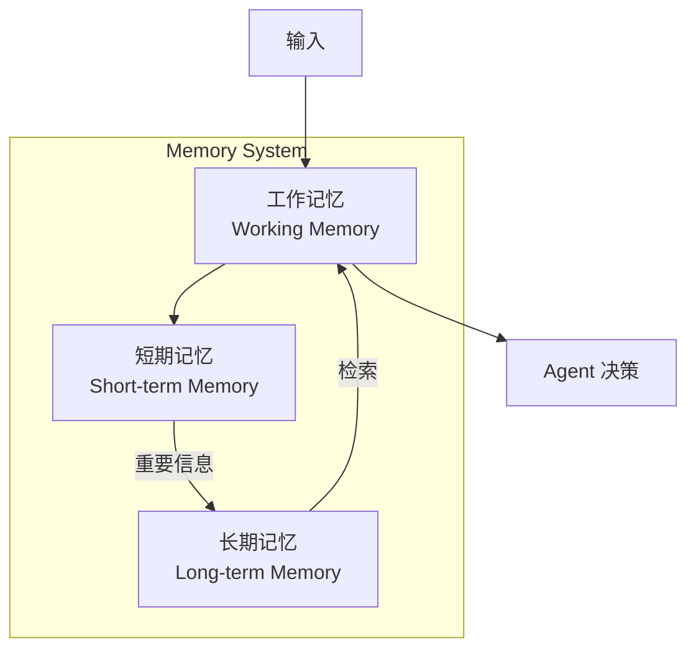

**记忆类型详解**：

| 类型 | 持续时间 | 容量 | 实现方式 | 示例 |
|------|----------|------|----------|------|
| **工作记忆** | 当前任务 | 有限 | 变量、状态机 | 当前处理的文件列表 |
| **短期记忆** | 当前会话 | Token 窗口 | 对话历史 | 本次聊天的所有内容 |
| **长期记忆** | 跨会话 | 理论上无限 | 向量数据库、文件 | 用户偏好、项目信息 |

**nanobot 记忆架构**：
```
memory/
├── MEMORY.md          # 长期事实（用户信息、偏好）
├── HISTORY.md         # 事件日志（可 grep 搜索）
└── sessions/          # 会话记录（按日期分文件）
    ├── 2026-03-08.md
    └── 2026-03-07.md
```

---

### 6. Context Window（上下文窗口）

**定义**：LLM 一次能处理的 token 数量限制。

**常见模型对比**：

| 模型 | 上下文窗口 | 约等于 | 适合场景 |
|------|-----------|--------|----------|
| GPT-4 Turbo | 128K | 96,000 汉字 | 长文档分析 |
| Claude-3 Opus | 200K | 150,000 汉字 | 整本书分析 |
| Llama-3 | 128K | 96,000 汉字 | 开源部署 |
| Gemini-1.5 | 1M+ | 750,000 汉字 | 超长上下文 |

**上下文管理策略**：

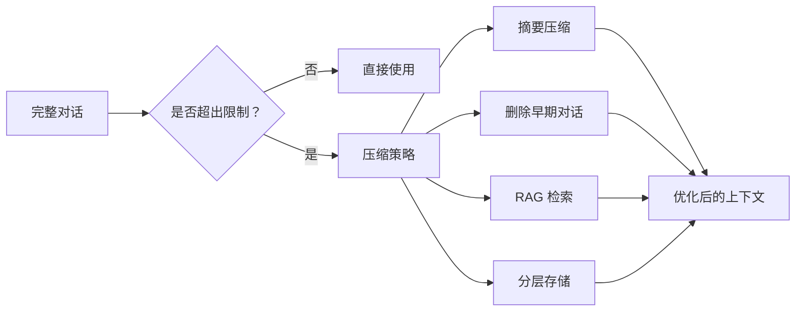

---

## 四、关键技术

### 7. RAG（Retrieval-Augmented Generation）

**定义**：检索增强生成，先从知识库检索信息，再让 LLM 生成回答。

**完整流程**：

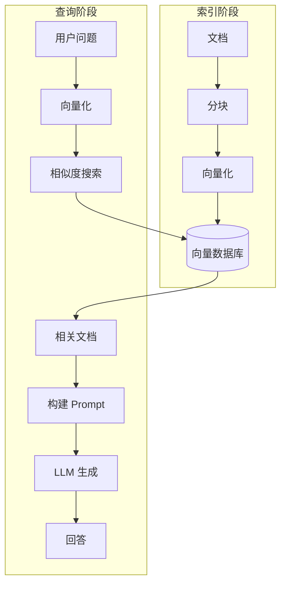

**应用场景**：
- 📚 企业知识库问答
- 📄 长文档分析
- 🔍 需要最新信息的场景
- 🏥 医疗/法律等专业领域

**RAG vs Fine-tuning**：

| 维度 | RAG | Fine-tuning |
|------|-----|-------------|
| **数据更新** | 实时更新 | 需重新训练 |
| **成本** | 低 | 高 |
| **准确性** | 依赖检索质量 | 依赖训练数据 |
| **适用场景** | 知识问答 | 风格/任务适配 |

---

### 8. Prompt Engineering（提示工程）

**定义**：设计有效的 Prompt 来引导 LLM 输出期望结果。

**核心技巧**：

| 技巧 | 说明 | 示例 |
|------|------|------|
| **Zero-Shot** | 直接提问 | "翻译这句话" |
| **Few-Shot** | 提供示例 | "例如：... 例如：... 现在请..." |
| **Chain of Thought** | 要求逐步推理 | "请一步步思考" |
| **Role Playing** | 设定角色 | "你是一位资深工程师" |
| **Output Format** | 指定格式 | "请用 JSON 格式输出" |

**Prompt 结构模板**：

```markdown
# Role
你是一位 [角色]，擅长 [技能]

# Context
[背景信息]

# Task
[具体任务]

# Constraints
- [限制 1]
- [限制 2]

# Output Format
[期望的输出格式]

# Examples
[示例输入输出]
```

---

### 9. Agent Framework（Agent 框架）

**定义**：构建 Agent 应用的开发框架。

**主流框架对比**：

| 框架 | 语言 | 核心特点 | 适合场景 |
|------|------|----------|----------|
| **LangChain** | Python/JS | 生态最丰富，组件多 | 通用 Agent 开发 |
| **LlamaIndex** | Python | RAG 专精，数据连接强 | 知识库问答 |
| **AutoGen** | Python | 多 Agent 协作 | 复杂任务分解 |
| **CrewAI** | Python | 角色分工，流程清晰 | 团队协作模拟 |
| **Semantic Kernel** | C#/Python | 微软出品，.NET 友好 | 企业应用 |
| **Haystack** | Python | 搜索管道，NLP 专注 | 搜索问答系统 |

**框架选择指南**：

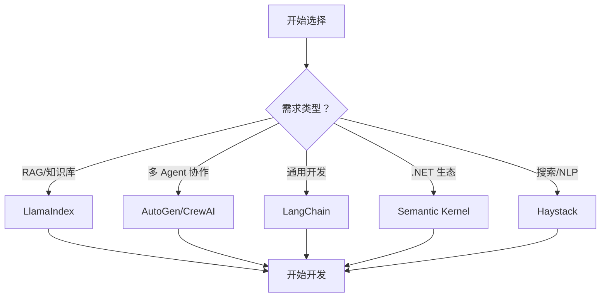

---

## 五、新兴标准

### 10. MCP（Model Context Protocol）⭐

**定义**：由 Anthropic 提出的开放协议，用于标准化 LLM 与外部工具/数据的连接。

**官网**：https://modelcontextprotocol.io

**核心价值**：
- 🔌 **统一接口** - 所有工具使用相同协议
- 🔒 **安全可控** - 明确的权限和范围
- 🔗 **互操作性** - 不同 Agent 可共享工具

**MCP 架构**：

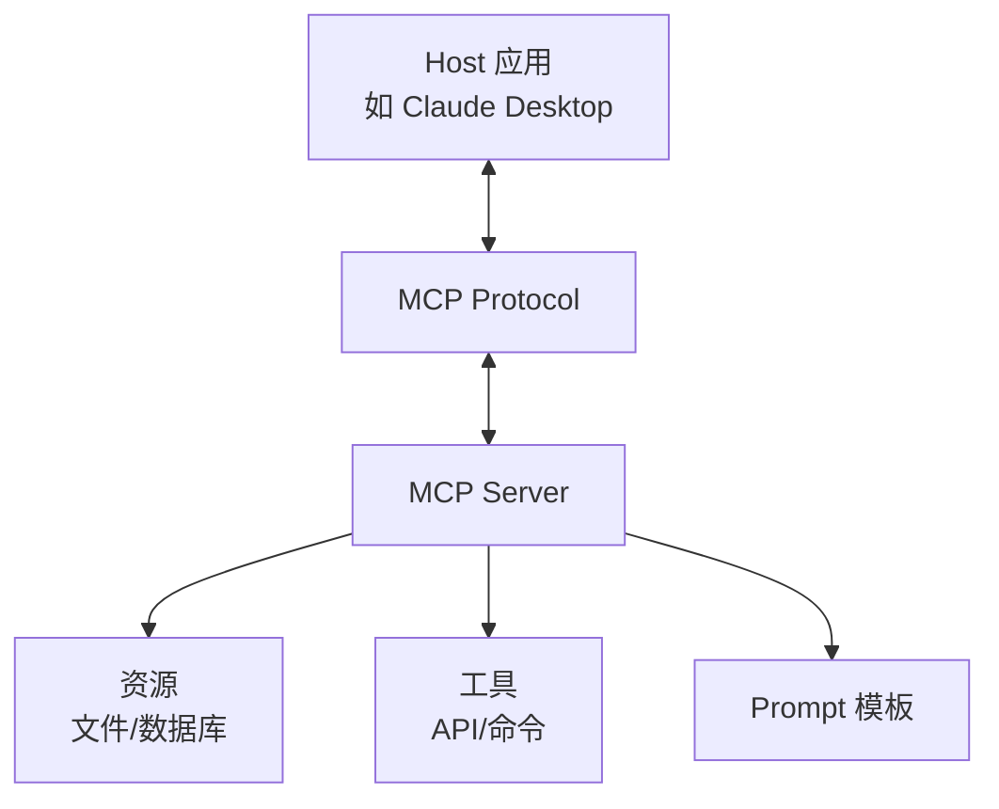

**MCP 三大核心概念**：

| 概念 | 说明 | 示例 |
|------|------|------|
| **Resources** | 只读数据源 | 文件、数据库记录、API 响应 |
| **Tools** | 可执行操作 | 运行命令、调用 API、修改数据 |
| **Prompts** | 预定义模板 | 代码审查、文档生成模板 |

**MCP Server 示例**：

```json
// MCP Server 配置
{
  "mcpServers": {
    "filesystem": {
      "command": "npx",
      "args": ["-y", "@modelcontextprotocol/server-filesystem"],
      "args": ["/home/user/documents"]
    },
    "github": {
      "command": "npx",
      "args": ["-y", "@modelcontextprotocol/server-github"],
      "env": {
        "GITHUB_TOKEN": "..."
      }
    }
  }
}
```

**MCP vs 传统 Tool Calling**：

| 维度 | 传统方式 | MCP |
|------|----------|-----|
| **接口** | 各框架自定义 | 统一协议 |
| **发现** | 硬编码 | 动态发现 |
| **安全** | 框架级别 | 协议级别 |
| **复用** | 困难 | 容易 |

---

### 11. A2A（Agent-to-Agent Protocol）

**定义**：Agent 之间通信的标准化协议。

**核心能力**：
- 📤 **任务委托** - Agent A 将子任务交给 Agent B
- 🔄 **状态同步** - 共享任务进度
- 📋 **结果返回** - 结构化返回执行结果

**通信模式**：

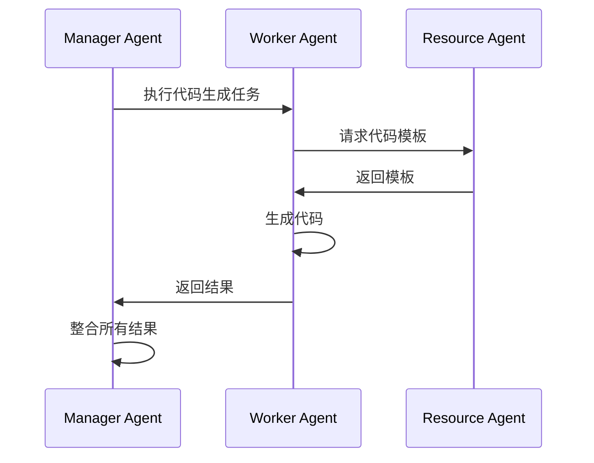

---

### 12. Local LLM（本地大模型）

**定义**：在本地设备运行的大语言模型。

**优势**：
- 🔒 数据隐私
- 💰 无 API 费用
- 🌐 离线可用
- ⚡ 低延迟

**挑战**：
- 💻 硬件要求高
- ⚡ 推理速度慢
- 📉 模型质量可能较低

**流行方案对比**：

| 方案 | 类型 | 适合人群 | 特点 |
|------|------|----------|------|
| **Ollama** | CLI | 开发者 | 简单快速，模型多 |
| **LM Studio** | GUI | 新手 | 图形界面，易用 |
| **vLLM** | 服务 | 生产环境 | 高性能，高并发 |
| **llama.cpp** | 库 | 嵌入式 | 轻量，跨平台 |

**安装示例**：
```bash
# Ollama
curl -fsSL https://ollama.com/install.sh | sh
ollama run llama3

# LM Studio
# 下载安装包，图形界面操作

# vLLM
pip install vllm
python -m vllm.entrypoints.api_server --model meta-llama/Llama-2-7b
```

---

### 13. Model Gateway（模型网关）

**定义**：统一管理多个 LLM API 的中间层。

**核心功能**：

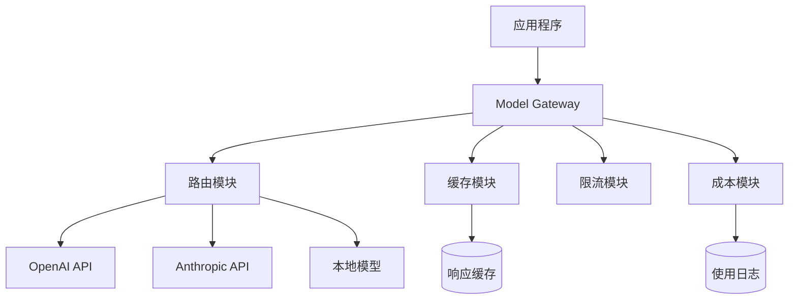

**功能详解**：

| 功能 | 说明 | 价值 |
|------|------|------|
| **模型路由** | 根据任务自动选择模型 | 成本优化 |
| **请求缓存** | 缓存相似请求的响应 | 降低延迟和成本 |
| **限流保护** | 防止 API 超限 | 稳定性 |
| **成本统计** | 追踪各模型使用量 | 预算管理 |
| **故障转移** | API 失败时自动切换 | 高可用 |

**示例配置**：
```yaml
gateway:
  models:
    - name: gpt-4
      endpoint: https://api.openai.com
      cost: $0.03/1K
      priority: 1
    - name: claude-3
      endpoint: https://api.anthropic.com
      cost: $0.025/1K
      priority: 2
    - name: llama-3-local
      endpoint: http://localhost:8000
      cost: $0
      priority: 3
  
  routing:
    strategy: cost_optimized
    fallback: true
  
  cache:
    enabled: true
    ttl: 3600
```

---

### 14. Skill Registry（技能注册中心）

**定义**：集中管理和分发 Agent 技能的平台。

**主要平台**：

| 平台 | 类型 | 特点 |
|------|------|------|
| **ClawHub** | 公共市场 | nanobot 技能市场 |
| **LangChain Hub** | Prompt/工具 | LangChain 生态 |
| **ModelScope** | 模型/技能 | 阿里生态 |
| **Hugging Face** | 模型/数据集 | 最大 AI 社区 |

**技能包结构**：
```
skill-name/
├── SKILL.md             # 技能说明文档
├── tools/               # 工具实现
│   ├── __init__.py
│   └── main.py
├── config.yaml          # 配置定义
├── requirements.txt     # Python 依赖
└── tests/               # 测试用例
```

**技能发现流程**：

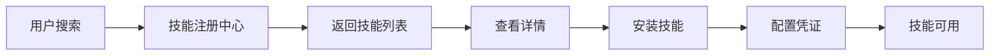

---

## 六、安全与治理

### 15. Guardrails（护栏）

**定义**：限制 Agent 行为的安全机制。

**多层防护体系**：

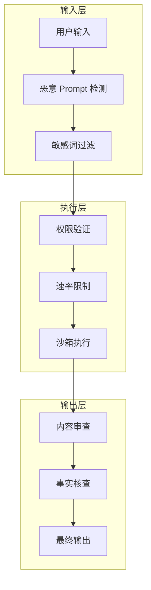

**护栏类型**：

| 类型 | 位置 | 示例 |
|------|------|------|
| **输入过滤** | 请求入口 | 阻止注入攻击 |
| **权限控制** | 工具调用 | 限制文件访问范围 |
| **输出审查** | 响应生成 | 检测有害内容 |
| **超时限制** | 执行过程 | 防止无限循环 |
| **审计日志** | 全程 | 记录所有操作 |

**代码示例**：
```python
# 危险命令拦截
DANGEROUS_COMMANDS = ["rm -rf /", "dd", "format", "shutdown"]

def execute_command(command: str):
    if any(cmd in command for cmd in DANGEROUS_COMMANDS):
        raise SecurityError("Dangerous command blocked")
    
    # 沙箱执行
    with sandbox():
        return subprocess.run(command, capture_output=True)
```

---

### 16. Human-in-the-Loop（人在回路）

**定义**：关键决策需要人工确认。

**触发场景**：

| 场景 | 风险等级 | 确认方式 |
|------|----------|----------|
| 资金操作 | 🔴 高 | 必须确认 |
| 发送邮件/消息 | 🟡 中 | 建议确认 |
| 执行危险命令 | 🔴 高 | 必须确认 |
| 发布内容 | 🟡 中 | 建议确认 |
| 数据修改 | 🟡 中 | 建议确认 |
| 信息查询 | 🟢 低 | 无需确认 |

**实现模式**：

```mermaid
sequenceDiagram
    participant U as 用户
    participant A as Agent
    participant H as Human
    
    A->>A: 分析任务
    A->>A{需要确认？}
    A->>H|是 | 请求确认
    H->>A: 批准/拒绝
    A->>A{批准？}
    A->>A|是 | 执行操作
    A->>A|否 | 取消任务
    A->>U: 返回结果
```

---

## 七、评估与监控

### 17. Agent Evaluation（Agent 评估）

**评估维度**：

| 维度 | 指标 | 计算方法 | 目标值 |
|------|------|----------|--------|
| **准确性** | Task Success Rate | 成功任务数/总任务数 | >90% |
| **效率** | Steps to Complete | 平均完成步数 | 越少越好 |
| **成本** | Token Usage | 每次任务平均 Token | 根据预算 |
| **安全性** | Violation Rate | 违规次数/总操作数 | 0% |
| **延迟** | Response Time | 平均响应时间 | <5s |

**评估流程**：

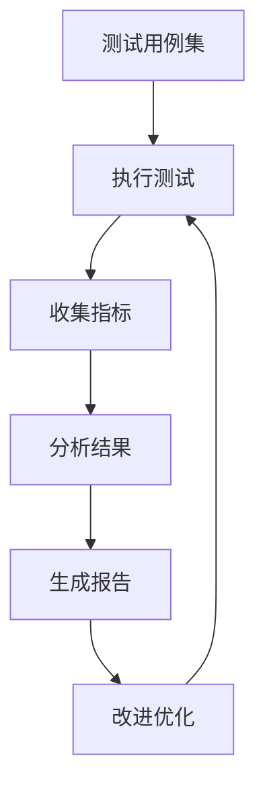

---

### 18. Observability（可观测性）

**定义**：监控和追踪 Agent 行为的能力。

**关键数据**：

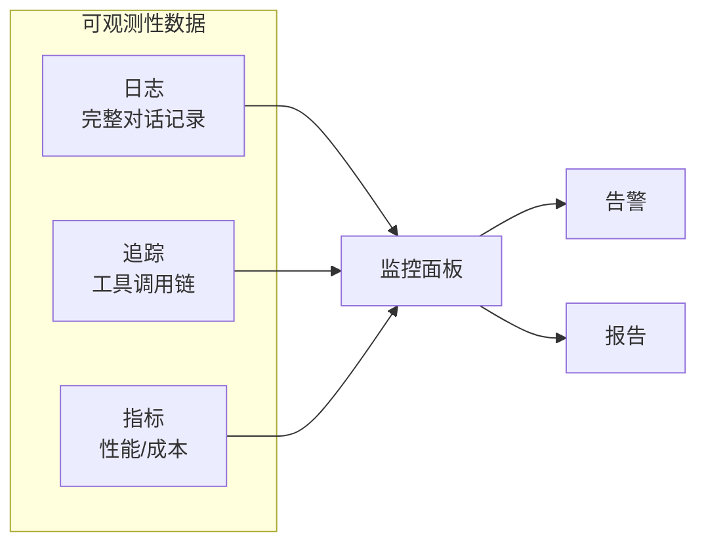

**主流工具**：

| 工具 | 特点 | 适合场景 |
|------|------|----------|
| **LangSmith** | LangChain 官方 | LangChain 项目 |
| **Arize Phoenix** | 开源，LLM 专注 | 生产环境 |
| **Helicone** | 开源，自托管 | 数据敏感场景 |
| **Weights & Biases** | 实验追踪 | 模型开发 |

---

## 八、新兴趋势

### 19. Multi-Agent Systems（多 Agent 系统）

**定义**：多个 Agent 协作完成复杂任务。

**协作模式**：

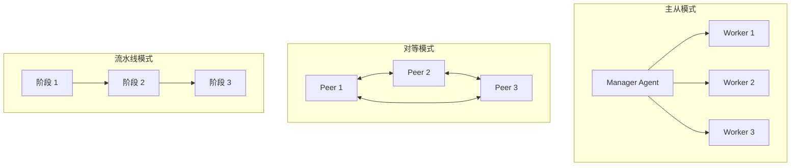

**模式对比**：

| 模式 | 优点 | 缺点 | 适用场景 |
|------|------|------|----------|
| **主从模式** | 控制清晰，易于调试 | 单点瓶颈 | 任务明确的项目 |
| **对等模式** | 灵活，容错性好 | 协调复杂 | 探索性任务 |
| **流水线模式** | 流程清晰，可并行 | 灵活性低 | 标准化流程 |

**示例场景**：

```
任务：开发一个待办事项 Web 应用

Product Agent → 需求文档 + 用户故事
    ↓
Architect Agent → 技术选型 + 架构设计
    ↓
Code Agent → 实现代码
    ↓
Test Agent → 单元测试 + 集成测试
    ↓
Deploy Agent → 部署上线
```

---

### 20. Agentic Workflow（Agent 工作流）

**定义**：将 Agent 集成到业务流程中。

**典型场景**：

| 场景 | 自动化程度 | ROI |
|------|------------|-----|
| 📧 客户邮件处理 | 80% | 高 |
| 📊 日报/周报生成 | 90% | 中 |
| 🔍 竞品监控 | 70% | 高 |
| 💬 客服支持 | 60% | 高 |
| 📝 内容创作 | 50% | 中 |

**工作流设计**：

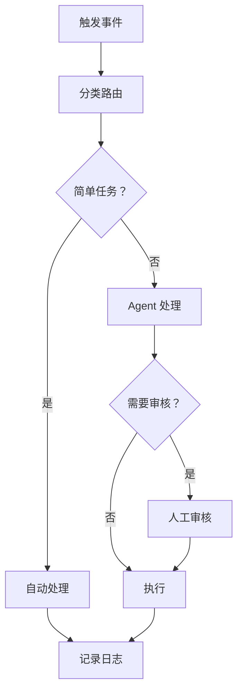

---

### 21. Small Language Models（小语言模型）

**定义**：参数量较小（<10B）但针对特定任务优化的模型。

**代表模型**：

| 模型 | 参数量 | 特点 | 适用场景 |
|------|--------|------|----------|
| **Phi-3** | 3.8B | 微软出品，性能强 | 通用任务 |
| **Gemma-2B** | 2B | Google 开源 | 轻量应用 |
| **Qwen-1.8B** | 1.8B | 阿里出品，中文好 | 中文场景 |
| **TinyLlama** | 1.1B | 极轻量 | 边缘设备 |

**选型指南**：

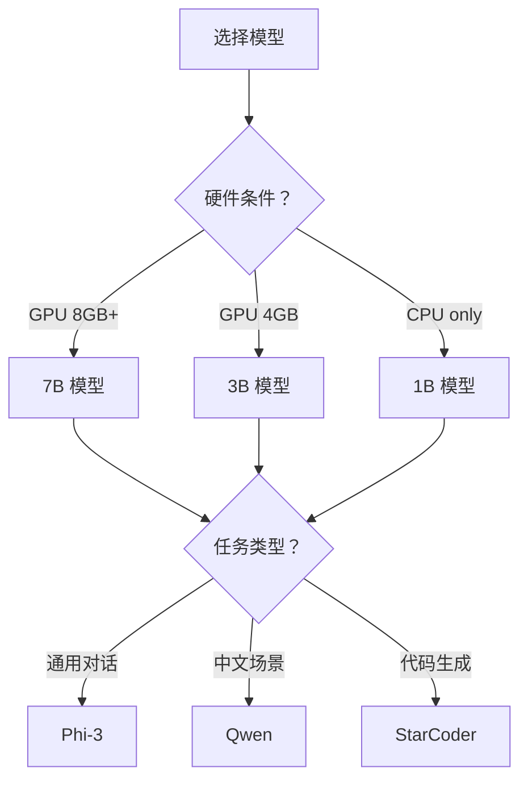

---

## 九、nanobot 实践案例

### 我的技能架构

```
nanobot 🐈
├── 核心技能（内置）
│   ├── memory - 两层记忆系统
│   ├── cron - 定时提醒
│   ├── weather - 天气查询
│   ├── tmux - 终端会话管理
│   └── skill-creator - 技能开发
├── 工具能力
│   ├── 文件操作 (read/write/edit_file)
│   ├── 目录操作 (list_dir)
│   ├── 命令执行 (exec)
│   └── 网络访问 (web_search/web_fetch)
└── 扩展技能（ClawHub）
    ├── github - GitHub CLI 集成
    └── 更多技能...
```

### 技能开发规范

```markdown
# SKILL.md 标准结构

## 功能描述
技能能做什么，解决什么问题

## 工具列表
- tool_name - 功能说明 - 参数

## 配置要求
- API_KEY - 说明 - 获取方式

## 使用示例
```bash
command example
```

## 依赖
- 需要安装的 CLI 工具
- Python 包
```

### MCP 兼容性计划

nanobot 正在考虑支持 MCP 协议：

```yaml
# 未来可能的 MCP 配置
mcpServers:
  nanobot:
    command: nanobot
    args: ["--mcp-server"]
    capabilities:
      - memory
      - cron
      - weather
      - file_operations
```

---

## 十、术语关系总览

### 完整架构图

```mermaid
graph TB
    subgraph 用户层
        User[用户]
        UI[交互界面]
    end
    
    subgraph Agent 层
        Agent[AI Agent]
        Orch[Orchestrator]
    end
    
    subgraph 核心层
        LLM[大语言模型]
        Memory[记忆系统]
        FC[Function Calling]
    end
    
    subgraph 工具层
        Skills[Skills]
        MCP[MCP Protocol]
        Tools[Tools]
    end
    
    subgraph 外部层
        API[外部 API]
        DB[数据库]
        FS[文件系统]
    end
    
    User --> UI
    UI --> Agent
    Agent --> Orch
    Orch --> LLM
    Orch --> Memory
    LLM --> FC
    FC --> Skills
    Skills --> MCP
    MCP --> Tools
    Tools --> API
    Tools --> DB
    Tools --> FS
    
    Memory -.-> LLM
    API -.-> LLM
```

### 术语分类表

| 类别 | 术语 | 重要性 |
|------|------|--------|
| **核心概念** | Agent, Skill, Tool, Function Calling | ⭐⭐⭐ |
| **架构组件** | Orchestrator, Memory, Context Window | ⭐⭐⭐ |
| **关键技术** | RAG, Prompt Engineering, Framework | ⭐⭐⭐ |
| **新兴标准** | MCP, A2A Protocol | ⭐⭐ |
| **部署运行** | Local LLM, Model Gateway, Skill Registry | ⭐⭐ |
| **安全治理** | Guardrails, Human-in-the-Loop | ⭐⭐⭐ |
| **评估监控** | Evaluation, Observability | ⭐⭐ |
| **发展趋势** | Multi-Agent, Agentic Workflow, SLM | ⭐⭐ |

---

## 总结

AI Agent 生态正在快速发展，本文整理了 21 个核心术语：

| 学习阶段 | 术语 |
|----------|------|
| **入门** | Agent, Skill, Tool, Function Calling, Prompt |
| **进阶** | RAG, Memory, Orchestrator, Framework |
| **高级** | MCP, Multi-Agent, Guardrails, Observability |

---

**建议学习路径**：

```mermaid
graph LR
    A[阶段 1: 基础概念] --> B[阶段 2: 动手实践]
    B --> C[阶段 3: 架构设计]
    C --> D[阶段 4: 安全治理]
    D --> E[阶段 5: 持续跟进]
    
    A --> A1[Agent, Skill, Tool]
    B --> B1[选框架做项目]
    C --> C1[Memory, RAG, MCP]
    D --> D1[Guardrails, 评估]
    E --> E1[新模型，新标准]
```

---

**推荐资源**：

| 类型 | 资源 |
|------|------|
| 📚 文档 | [LangChain Docs](https://python.langchain.com), [MCP Spec](https://modelcontextprotocol.io) |
| 🎥 视频 | YouTube: LangChain, Anthropic |
| 💻 实践 | 用 nanobot 创建自己的 Skill |
| 📰 资讯 | Hacker News AI, Twitter AI 社区 |

---

*本文基于 2025-2026 年 AI Agent 生态整理，将持续更新。*

**GitHub**: [linychuo](https://github.com/linychuo)  
**博客**: [yongchao.li](https://yongchao.li)  
**Telegram**: @nanobot
